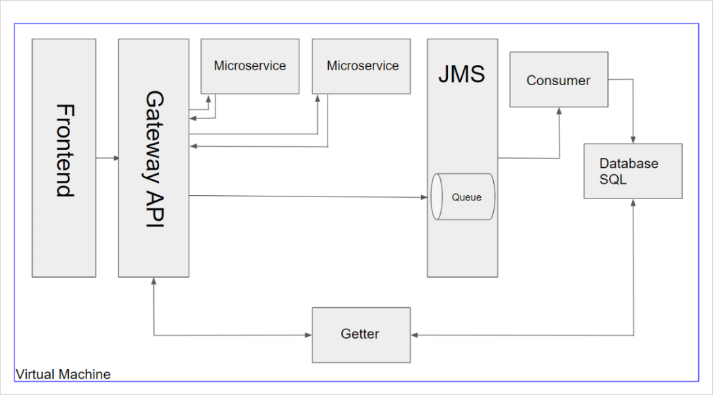

# QA Group Project
This parent folder contains micro-services which facilitate the running of an Apartment Management System.
Collaborators include;

	- [Anthony Truran](https://github.com/AntonyTruran)
	- [James Ingram](https://github.com/smurfjames101)
	- [Luke Jones](https://github.com/BetaDraconis)
	- [Kyle Warrington](https://github.com/Kyrvix)
	- [Ryan Lang](https://github.com/RyanLang44)
## Contents
 - [**Initial Overview**](https://github.com/AntonyTruran/GroupProject/tree/ReadMe#initial-overview)
	 - Plan
	 - Options Considered
	 - [Project Outline - AMS](https://github.com/AntonyTruran/GroupProject/tree/ReadMe#project-outline---accommodation-management-system)
		 - Overall Architecture
		 - Database - Structure and Relationships
		 - Back-end - API Architecture
		 - Front-end - Wire Frame

## Initial Overview
### Plan
1.  **Gather general information about the project.** Interview relevant personnel to
determine what key functionality would be required in any potential solution. If a
version of the system already exists, also investigate how the current system could
be improved, and what parts of the current system they wish to retain.

2.  **Bring together initial findings.** Produce basic project outline. Make initial
assessment on project architecture, and which tools/technology may be suitable.
Conduct second round of interviews to verify any assumptions, gather additional
information, and ask more specific questions about the project.

3. **Construct full project overview.** Use feedback from second round of interviews to
produce a comprehensive plan for the project. Include a consideration of business
logic, front-end wire frames, use cases, and architecture and present to client for
approval. Make final decision on tools/ technology to be used.
### Options Considered
---
- **Interview management system** (**`Chester`**):
	- Automate the process of delivering interviews and recording assessment.
	- Persistent storage of interview results accessible by trainers/ management.
	- Report functionality for different trainers/ assessment day groups.
	- User account functionality with different access levels.
- **CV management system** (**`Bob/Dev`**):
	- Allow trainees to create a user profile, upload CVs to be stored persistently.
	- Trainer accounts can view trainee profiles, provide feedback on CVs.
	- Implement admin user with user/data management functionality.
	- User account functionality with different access levels.
- **Accommodation** (**`Hannah`**):
	- Persistent data storage (Stretch goal – security -- Adhere to GDPR).
	- Form-based search functionality (filterable by Name/Apartment/intake etc.).
	- Ability to edit data on both an individual, and a group basis (i.e by intake).
	- Note functionality to allow for comments/ important information to be stored.
	- Lightweight user-interface and data reporting features. Make sure to retain
	“wide” calendar view for displaying data over long timescales.
	- Keeping track of cleaning (roughly 1 apt/day), maintenance, and occupation.
	- Stretch goal – document repository – secure – keep track of all letters/notes
about people apartments tracked with that person.
	- Take over from current system (Excel spreadsheet) and move data across.
	- User account functionality (Stretch goal – security – Email validation)
	- Stretch goal – security – Encrypt data (hash) for added security.

### Project Outline - Accommodation Management System
#### Overall Architecture

**`Figure 1:`** 
````
Overall project architecture diagram. The product will consist of 3 main parts: the
database (utilising MySQL), the front-end (built in React and CSS), and the back-end. The
back-end is further split up into the gateway API, and various micro services (Using the
Spring Java Framework), as well as a queueing system (JMS, activeMQ). The product will
be hosted on a virtual machine (making use of Jenkins, Docker, and GCP), using GitHub as
a source-code repository. See Figure 3 for more details about the front-end, and back-end.
````
#### Database – Structure and relationships


**`Figure 2:`**
````
Expanded architecture diagram for the front-end and back-end sections of Figure 
1. Shows the many different micro-services which will be implemented, with the Room API 
also acting as the Gateway. Also demonstrates how different parts of the system (i.e Front-
end. Queueing system, database) will interact with the back-end.
````
#### Back-end – Front-end and API Architecture 


**`Figure 3:`**
````
Entity relationship diagram to show the approximate relational database structure which is 
intended to be implemented in this project. The ‘main’ table is to be the ‘Rooms’ table, 
which has the most relationships.
````
#### Front-end – Wireframe


**`Figure 4:`**
````
Wire-frame diagram depicting a proposed section of the front-end application interface. This specific wireframe shows how the occupation status of different apartments, from different buildings, would be displayed with respect to time.
````


**`Figure 5:`**
````
See Figure 4. Here is demonstrated how the ‘group’ functionality is intended to function. On this page details about a group of tenants will be displayed. The user will also be able to make bulk changes to tenants by applying them to the group as a whole.
````
 will also be integrated to allow the user to search for a specific data entry.
````
